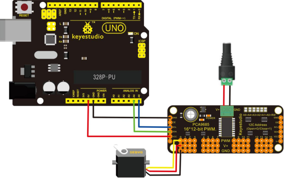
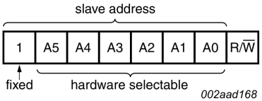

# KS0065 keyestudio 16-channel 12-bit PWM/Servo Driver - I2C Interface


## 1. Introduction

You want to make a cool robot, maybe a hexapod walker, or maybe just a piece of art with a lot of moving parts. Or maybe you want to drive a lot of LEDs with precise PWM output. Then you realize that your microcontroller has a limited number of PWM outputs! What now?

You could give up or you could just get this handy PWM and Servo driver breakout.

When we saw this chip, we quickly realized what an excellent add-on this would be. Using only two pins, control 16 free-running PWM outputs! You can even chain up 62 breakouts to control up to 992 PWM outputs (which we would really like to see since it would be glorious).

It's an i2c-controlled PWM driver with a built in clock. That means that, unlike the TLC5940 family, you do not need to continuously send it signal tying up your microcontroller, its completely free running!

It is 5V compliant, which means you can control it from a 3.3V microcontroller and still safely drive up to 6V outputs (this is good for when you want to control white or blue LEDs with 3.4+ forward voltages)

- 6 address select pins so you can wire up to 62 of these on a single i2c bus a total of 992 outputs - that's a lot of servos or LEDs
- Adjustable frequency PWM up to about 1.6 KHz
- 12-bit resolution for each output - for servos, that means about 4us resolution at 60Hz update rate
- Configurable push-pull or open-drain output
- Output enable pin to quickly disable all the outputs
- We wrapped up this lovely chip into a breakout board with a couple nice extras terminal block for power input (or you can use the 0.1" breakouts on the side)
- Reverse polarity protection on the terminal block input
- Green power-good LED
- 3 pin connectors in groups of 4 so you can plug in 16 servos at once (Servo plugs are slightly wider than 0.1" so you can only stack 4 next to each other on 0.1" header
- A spot to place a big capacitor on the V+ line (in case you need it)
- 220 ohm series resistors on all the output lines to protect them, and to make driving LEDs trivial
- Solder jumpers for the 6 address select pins
- This board/chip uses I2C 7-bit address between 0x40-0x7F, selectable with jumpers

## 2. Specification

- This board/chip uses I2C 7-bit address between 0x60-0x80, selectable with jumpers
- Dimensions (no headers or terminal block) 2.5" x 1" x 0.1" (62.5mm x 25.4mm x 3mm)
- Weight (with 3x4 headers & terminal block): 9grams

## 3. Connection Diagram



## 4. I2C Communication Address Settings

- **For Hardware:**




Pin A5-A0 is suspended on the module. The default address is 100 000, that is 40.

We are able to add 0Ωresistance appropriately in the A5-A0; set the communication addresses. If the pin A5 - A0 all add 0Ωresistance, the address is 111, 1111, that is 7F.

- **For Software:**
  - // called this way, it uses the default address 0x40
  - Adafruit_PWMServoDriver pwm = Adafruit_PWMServoDriver();
  - // you can also call it with a different address you want
  - //Adafruit_PWMServoDriver pwm = Adafruit_PWMServoDriver(0x41);

## 5. Sample Code

Download  Resource  : [Resource](./Resource.7z)

Note： before uploading the code, you need to import the library files; otherwise, the code upload will fail.

```c
#include <Wire.h>
#include <Adafruit_PWMServoDriver.h>
// called this way, it uses the default address 0x40
Adafruit_PWMServoDriver pwm = Adafruit_PWMServoDriver();
// you can also call it with a different address you want
//Adafruit_PWMServoDriver pwm = Adafruit_PWMServoDriver(0x41);

// Depending on your servo make, the pulse width min and max may vary, you 
// want these to be as small/large as possible without hitting the hard stop
// for max range. You'll have to tweak them as necessary to match the servos you
// have!
#define SERVOMIN  150 // this is the 'minimum' pulse length count (out of 4096)
#define SERVOMAX  600 // this is the 'maximum' pulse length count (out of 4096)

// our servo # counter
uint8_t servonum = 0;

void setup() 
{
  Serial.begin(9600);
  Serial.println("16 channel Servo test!");

  pwm.begin();
  
  pwm.setPWMFreq(60);  // Analog servos run at ~60 Hz updates
}

// you can use this function if you'd like to set the pulse length in seconds
// e.g. setServoPulse(0, 0.001) is a ~1 millisecond pulse width. its not precise!
void setServoPulse(uint8_t n, double pulse) 
{
  double pulselength;
  pulselength = 1000000;   // 1,000,000 us per second
  pulselength /= 60;   // 60 Hz
  Serial.print(pulselength); Serial.println(" us per period"); 
  pulselength /= 4096;  // 12 bits of resolution
  Serial.print(pulselength); Serial.println(" us per bit"); 
  pulse *= 1000;
  pulse /= pulselength;
  Serial.println(pulse);
  pwm.setPWM(n, 0, pulse);
}

void loop() 
{
  // Drive each servo one at a time
  Serial.println(servonum);
  for (uint16_t pulselen = SERVOMIN; pulselen < SERVOMAX; pulselen++) 
  {
    pwm.setPWM(servonum, 0, pulselen);
  }
  delay(500);
  for (uint16_t pulselen = SERVOMAX; pulselen > SERVOMIN; pulselen--) 
  {
    pwm.setPWM(servonum, 0, pulselen);
  }
  delay(500);
  servonum ++;
  if (servonum > 15) servonum = 0;
}
```

